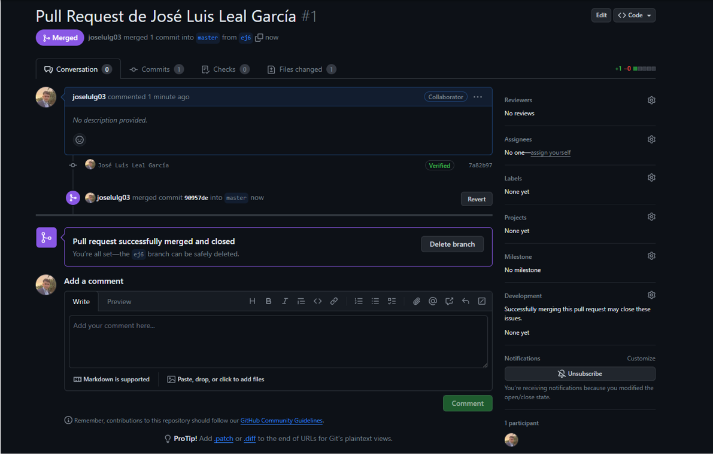

# PULL REQUEST

## 1. DEFINICIÓN

Es una función de Github con la cuál se pueden presentar cambios en un repositorio para que sean revisados antes de publicarlos, permitiendo una colaboración ordenada y segura por parte de los desarrolladores.

## 2. FUNCIONAMIENTO

La pull request es útil cuando estás trabajando en un proyecto con otros desarrolladores, y cada integrante modifica o crea código, por tanto, necesitarás tener una copia del código que hasta ahora estaba funcionando para no perderlo. Entonces, cuando ya has terminado tu código, haciendo la pull request estás enviando una especie de notificación a los integrantes para que revisen tus cambios, y una vez que estén de acuerdo, el administrador podrá fusionar los cambios en el proyecto principal.

## 3. PASOS PARA CREAR UNA PULL REQUEST

### a. Crear una Rama (Branch)

También es posible hacerlo por comandos de git.

### b. Realizamos algunos cambios en la rama haciendo commits

### c. Abrimos una pull request

### d. Realizamos la operación de Merge.

